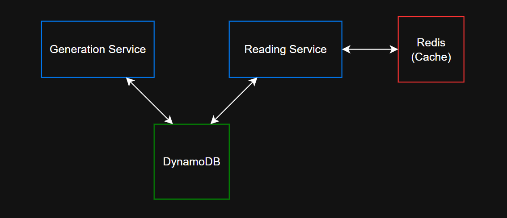

# A Basic URL Shortening Service in Go

    A basic microservice-based URL shortening system built with Go, DynamoDB, Redis

* Generation Service (Port 8081): Creates short URLs
* Reading Service (Port 8082): Retrieves and redirects original URLs

